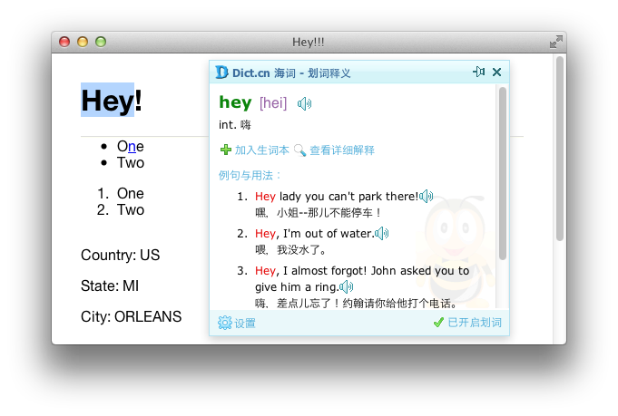
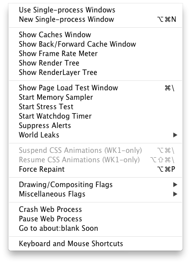

# Safari 中文插件

## 1.海词网 Safari 翻译插件(非官方)

## 2.Google PageRank
[Beyond PageRank: Graduating to actionable metrics](http://googlewebmastercentral.blogspot.com/2011/06/beyond-pagerank-graduating-to.html)

## 3.Safari 状态栏
简化版[Ultimate Status Bar](http://ultimatestatusbar.com)，根据 [Minimal Status Bar](https://github.com/visnup/Minimal-Status-Bar) 修改而来，修复 reset 样式显示错误。

## 开启 Safari 隐藏调试菜单

退出 Safari

开启终调试菜单，终端录入：

	$ `defaults write com.apple.Safari IncludeInternalDebugMenu 1`

关闭终调试菜单，终端录入：
	
	$ `defaults write com.apple.Safari IncludeInternalDebugMenu 0`
	

注： 5.1 与 5.2 功能不同。

5.2 加入 [Safari Omnibar](http://hackemist.com/SafariOmnibar/)